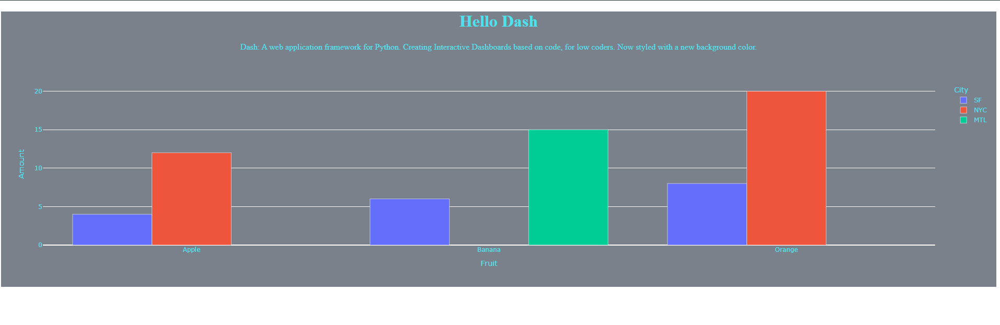
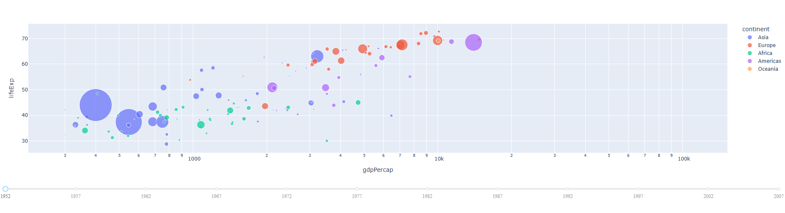
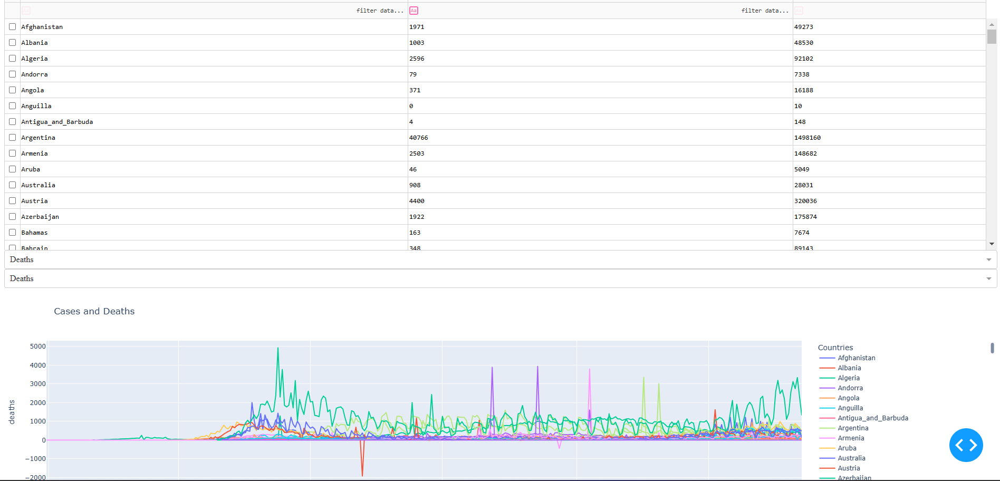
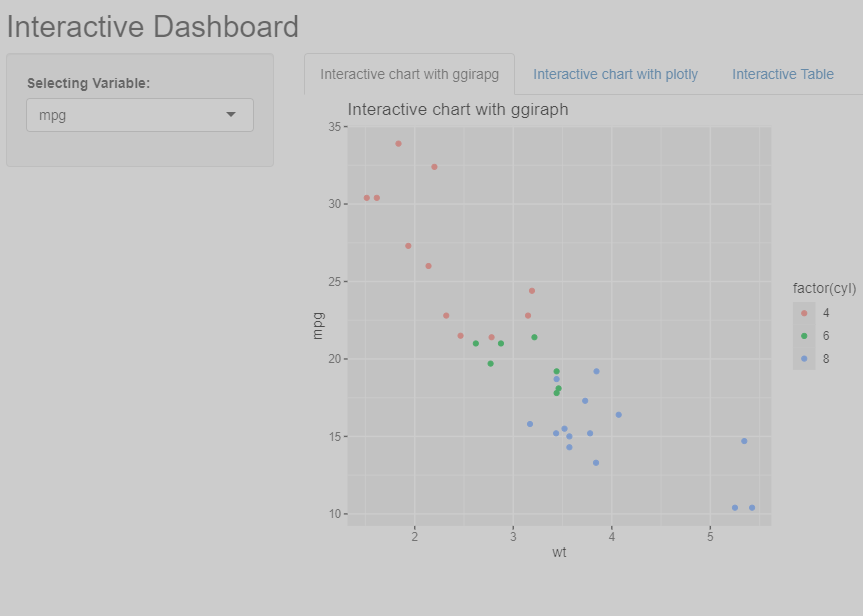

These are activities to learn about Data Visualization in Web environments.

Beginning with the implementation of Plotly and Dash, because my knowledges in Python.

The main course is https://www.udemy.com/course/visualizacion-interactiva-con-python. There were some exercise where was necessary to apply some changes because library updates.

In general this course is a good introduction to implement these tools, step by step, since create basic visuals until create interactive dashboards.

The next images are just for the Python folder







## Implementation

This project is managed uv, so you can run each script by:

```bash
cd .\interactive_dashboard_with_Python\
```

If is the first time in this repository

```bash
uv sync
```

And then 

```bash
uv run script.py
```

Incase when the framework is shiny, run with:

```bash
uv run shiny run --reload script.py
```

# Now with R

And the course to learn this kind of visualization for R is:
https://www.udemy.com/course/el-arte-de-programar-en-r-anade-valor-a-tu-cv 



Keep in mind, the main pillar of working with R is shiny, a great package/framework to create apps in R. These recently could be dockerising with different metodologies and be deployed as any other language.


## Implementation

This project is managed uv, so you can run each script by:

```bash
cd .\interactive_dashboard_with_R\
```

If is the first time in this repository

```bash
rv sync
```

And then (optional add a specific port)

```bash
Rscript -e "shiny::runApp('script.R', port = 4949)"
```