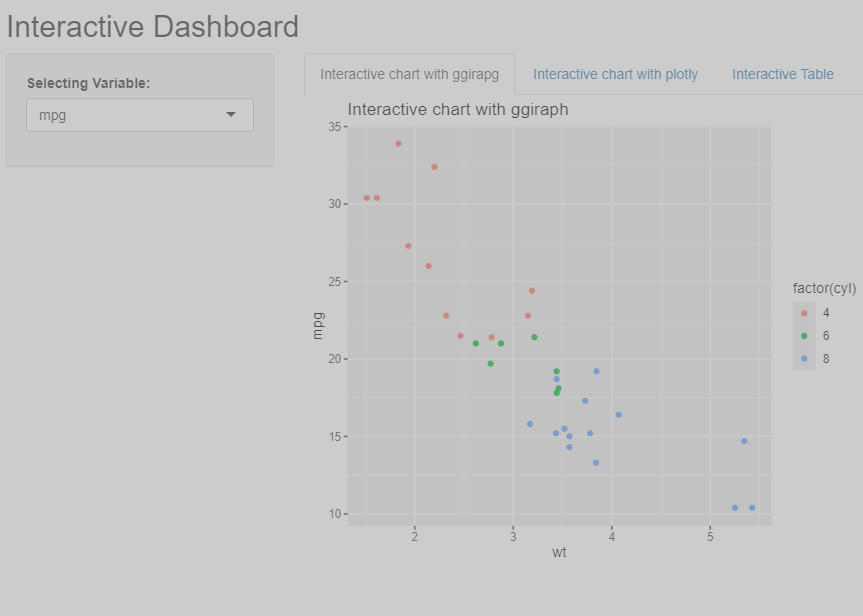

These are activities to learn about Data Visualization in Web environments.

Beginning with the implementation of Plotly and Dash, because my knowledges in Python.

The main course is https://www.udemy.com/course/visualizacion-interactiva-con-python. There were some exercise where was necessary to apply some changes because library updates.

In general this course is a good introduction to implement these tools, step by step, since create basic visuals until create interactive dashboards.

The next images are just for the Python folder

# Now with R

And the course to learn this kind of visualization for R is:
https://www.udemy.com/course/el-arte-de-programar-en-r-anade-valor-a-tu-cv/?couponCode=ST20MT190425G1 

